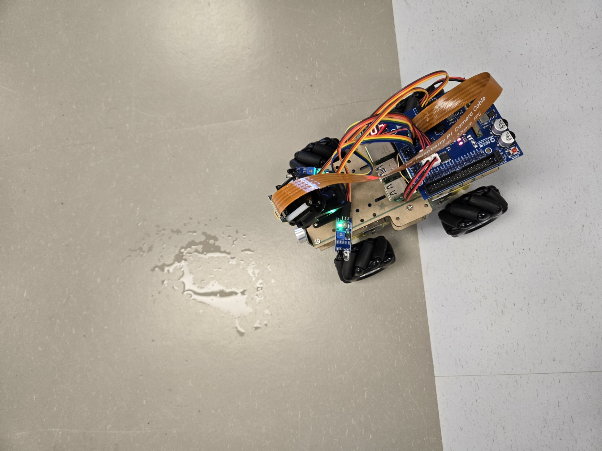
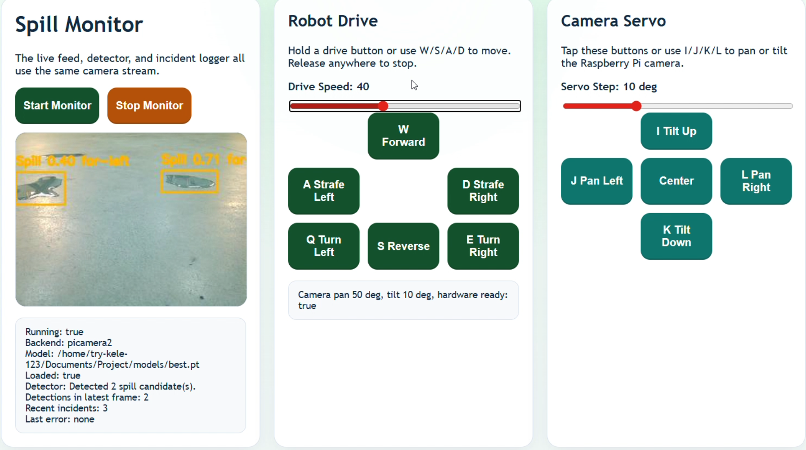
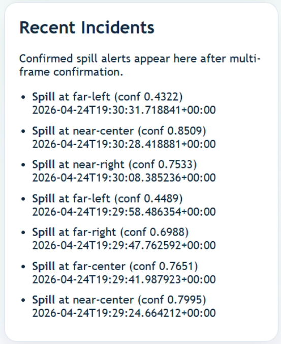

# Spill Detection Robot

A small Raspberry Pi robot that helps spot spills, watch the area through a live camera, and save a record when something needs attention.



## What This Project Does

This project combines a camera, a simple web dashboard, and spill detection software. The goal is to let someone drive the robot, see what the robot sees, and quickly notice possible liquid spills.

When the robot sees something that looks like a spill, it can record the incident so it is easier to review later.

## What You Can Do With It

- Drive the robot from a web page
- Watch the live camera feed
- Detect possible spills
- Review saved incident reports
- Use it as a base for a mechatronics or robotics project

## Web Dashboard

The dashboard gives the operator one place to control the robot and monitor what it sees.



## Incident Reports

When a possible spill is found, the project can save a report for later review.



## Project Files

- `app.py` starts the web dashboard
- `camera.py` handles the camera feed
- `detector.py` looks for spills in the camera image
- `robot_control.py` controls robot movement
- `incident_manager.py` and `reporter.py` help save incident records
- `pics/` contains images used in this README

## How To Run It

From the project folder:

```bash
source .venv/bin/activate
python app.py
```

Then open the dashboard in a browser using the address shown in the terminal.

## Notes

This was built as a student robotics project, so it is meant to be readable, easy to demonstrate, and simple to build on.
